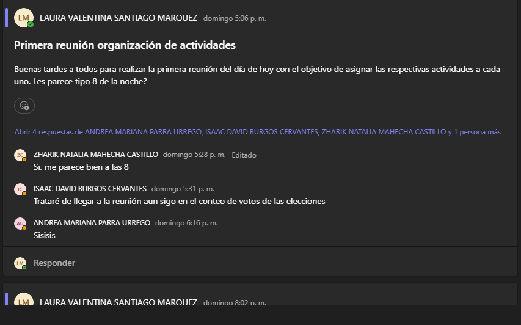
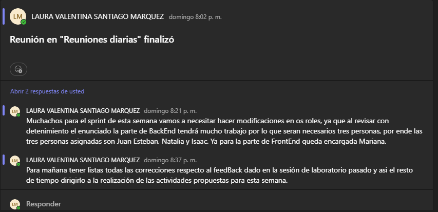
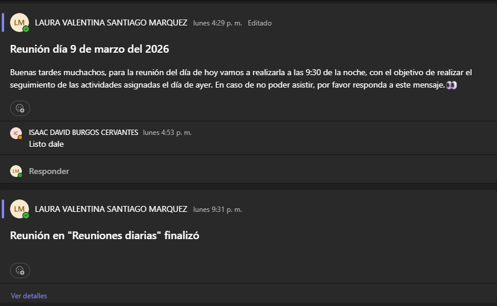
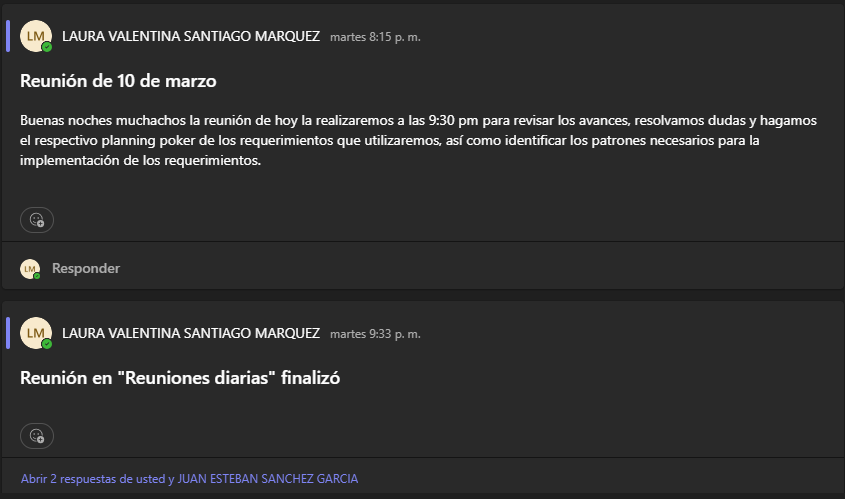
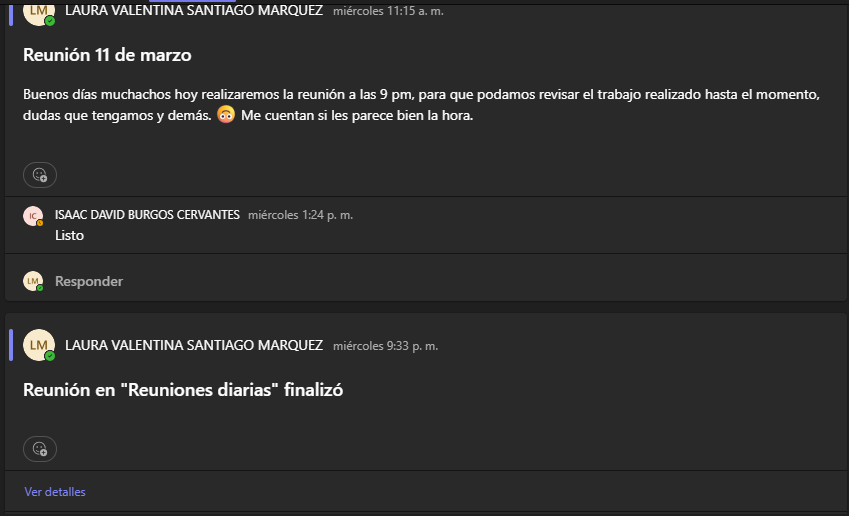
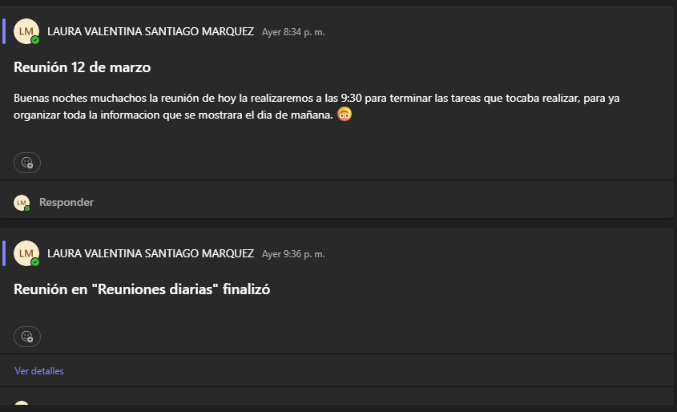

# Backend para TECHCUP 
# SPRINT 1

## Integrantes del equipo

- Juan Esteban Sanchez
- Zharik Natalia Mahecha
- Mariana Parra Urrego
- Isaac David Burgos
- Laura Valentina Santiago - Lider

## Descripcion

Este repositorio contiene la implementación del backend del sistema TechCup,
una plataforma diseñada para la gestión de torneos de fútbol universitarios.

El sistema está construido utilizando Spring Boot y sigue una arquitectura
MVC para organizar los componentes del sistema.

## Arquitectura

El backend sigue el patrón MVC:

Controller → Maneja las peticiones HTTP
Service → Implementa la lógica de negocio
Models / DTOs → Representan la información del sistema
Validators → Validan los datos de entrada

## Requerimientos funcionales 

TC-01  Iniciar sesión  
TC-02  Crear torneo  
TC-03  Inicializar torneo  
TC-04  Finalizar torneo  
TC-05  Consultar torneos  
TC-06  Registrar jugadores  
TC-07  Crear perfil deportivo

## Gestión del proyecto

El proyecto se organiza utilizando metodología ágil Scrum.

Cada materia se gestiona como una épica dentro de Jira y las funcionalidades se
organizan mediante Features, Historias de usuario y Subtareas.

Se utiliza planificación por sprints para dividir el desarrollo en iteraciones.

## Sprint 1

### Objetivo del Sprint
Implementar las funcionalidades iniciales del sistema relacionadas con la autenticación
de usuarios y la gestión básica de torneos.

### Historias incluidas

- Iniciar sesión
- Crear torneo
- Inicializar torneo
- Finalizar torneo

## Matriz de trazabilidad

La matriz de trazabilidad permite relacionar los requerimientos funcionales con las
historias de usuario, tareas y funcionalidades implementadas en el sistema.

## Patrones de diseño utilizados

1. Factory Method: para crear los diferentes tipos de usuario.
El sistema necesita crear muchas tipos de usuario distintos: estudiantrs, graduados, profesore.., poner todo eso en un solo bloque de codigo seria dficil de mantener porque tendria muchos if- else.
con factory method cada usuario tiene su propia fabica que sabe como crearlo, si despues necesito agregar un nuevo tipo de usuario, solo creo una nueva fabrica sin tocar lo que ya existe
2. Strategy: para la autentificacion
Para ingresar al sistema hay dos formas con correo institucional o Gmail, en lugar de llenar el login con condiciones es mas facil encapsular cada forma de identificarse en su propia clase
3. Builder: Para crear torneos
Crear un torneo no es solo darle un nombre, tiene fechas, canchas, horarios...
builder ayuda a crear el torneo paso a paso
4. Chain of responsability: para validar
cuando el capitan sube el comprobante de pago, ese archivo debe pasar por varias validaciones, con este patron cada validador revisa lo suyyo y si pasa lo manda al siguiente, en caso de fallas se detiene y retona el rechazo
5. Observer: Para las notificaciones
Hay momentos en el sistema donde algo pasa y varias partes necesitan enterarse, en lugar de que cada clase llame a quien necesita saber es mas eficiente que observer les avise automaticamente a los que le interesa esa notificacion.

## Diagramas

### Diagrama de clases

### Diagrama de componentes general

### Diagrama de componentes especifico

## Pruebas

Para cada funcionalidad se definieron casos de prueba:

- Casos de éxito
- Casos de error
- Casos condicionales según validaciones

## Evidencia de dailys

Daily 1

¿Qué se realizó?: Leimos el enunciado para esta semana y divimos el trabajo teniendo en cuenta la carga de cada parte.
En el backend teniamos que realizar muchas cosas por lo que asigamos a tres personas para ello.

Bloqueo: ninguno

Daily 2

¿Qué se realizó?: Revisamos que las correcciones realizadas en la clase anterior por el profesor fueran resueltas para poder comenzar con 
la siguiente parte que correspondia al sprint 1. Revisamos dudas que teniamos sobre el enunciado y demas.

Bloqueo: ninguno

Daily 3

¿Qué se realizó?: Seleccionamos los requerimientos que ibamos a implemnetar en este sprint y realizamos el planning poker.

Bloqueo: Diagramas de clases

Daily 4

¿Qué se realizó?: Revisamos los avances que teniamos hasta el momento, diagrama de clases teniendo en cuenta los patrones que 
habiamos identificado, un poco de la implementacion del codigo y funcionalidad del mockup.

Bloqueo: Dudas en codigo y diagramas de componentes.

Daily 5

¿Qué se realizó?: Revision de todas las tares que hizo falta y que cosas ya estaban completadas. Organizacion para presentacion

Bloqueo: Ninguno

