# Sprint 2

##  Integrantes del Equipo

| Nombre                   | Rol     |
|--------------------------|---------|
| Juan Esteban Sanchez     | Fronted |
| Zharik Natalia Mahecha   | Fronted |
| Mariana Parra Urrego     | Lider   |
| Isaac David Burgos       | Backend |
| Laura Valentina Santiago | Backend |

### Historias incluidas

- Gestion de disponibilidad
- Recibir y responder invitaciones de equipo
- crear y gestionar equipo
- Subir comprobante de pago
- Busqueda de jugadores por filtro
- Cambiar estado de pago

## Pruebas en postman

### POST/payments/upload

* Prueba 1 comprobante aprobado

En esta prueba se simula si se subiera un comprobante correctamente

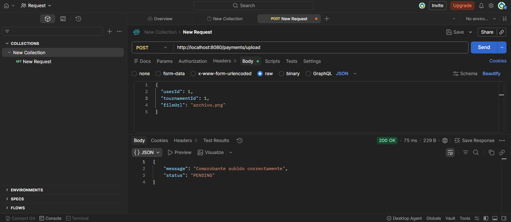

* Prueba 2 comprobante sin usuario

Se hace una solicitud sin incluir el userId y el servidor responde 400 Bad Request con el mensaje 
"El usuario es obligatorio".

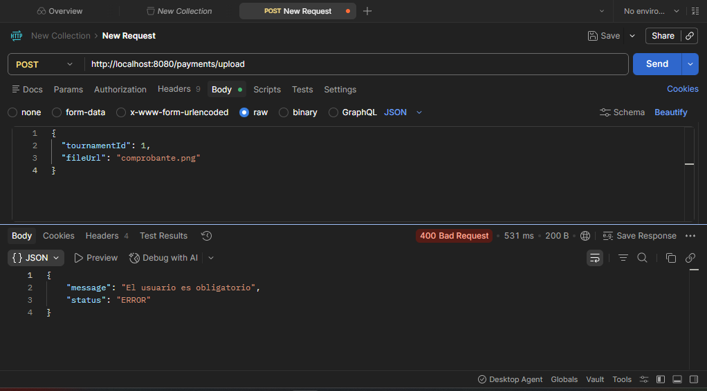

* Prueba 3 comprobante sin subir

Se envía userId y tournamentId pero sin el fileUrl. El servidor responde 400 Bad Request con el
mensaje "El comprobante es obligatorio".

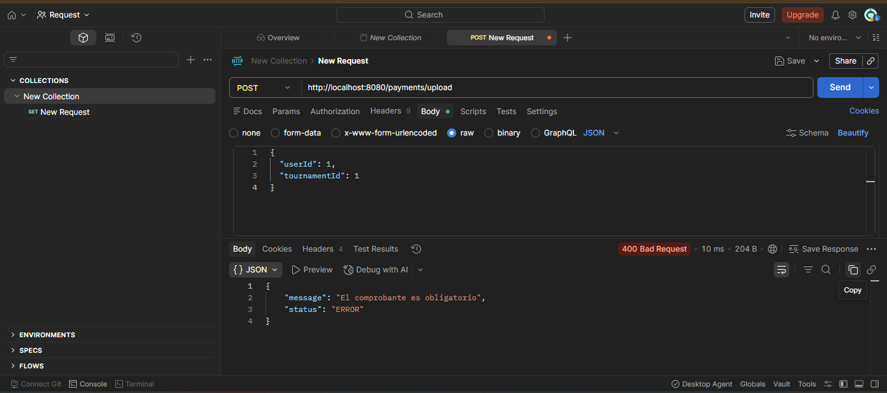

### PUT/payments/status

* Prueba 4 pago aprobado

Pago Aprobado

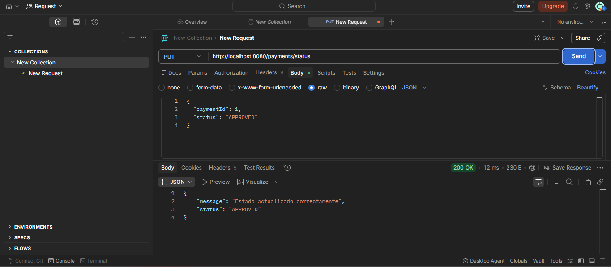

* Prueba 5 pago rechazado

Pago rechazado

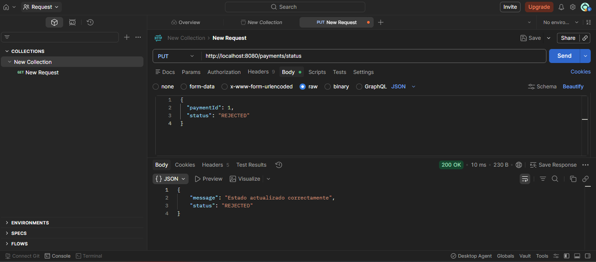

* Prueba 6 pago sin Id 

Se envia un pago sin id y el servidor dice que el id es obligatorio.

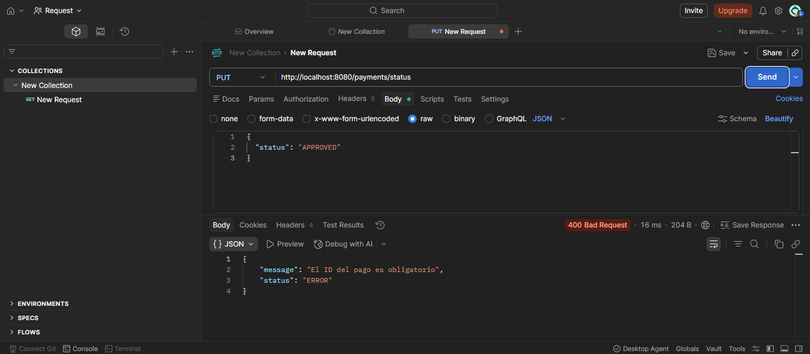

* Prueba 7 pago no encontrado

Se envía paymentId: 999 con estado APPROVED y el servidor responde 400 Bad Request indicando que el pago no fue encontrado.

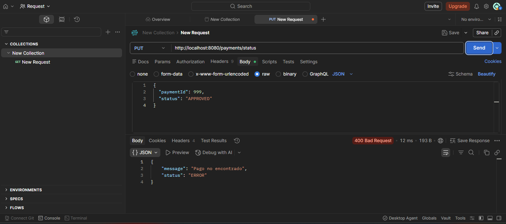

## Swagger
* El controlador de Pagos expone tres endpoints: subir comprobante (POST /payments/upload), cambiar estado de pago 
(PUT /payments/status) y un test de conexión (GET /payments/test).

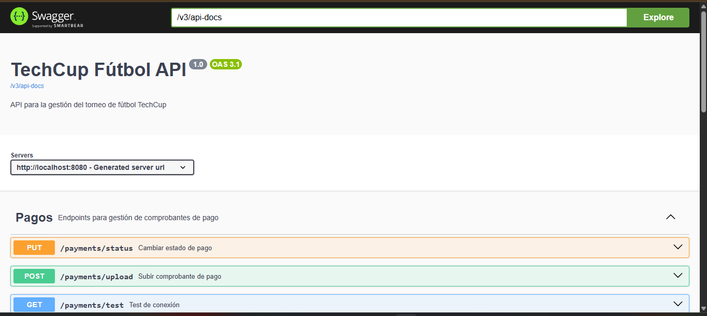

* El tournament-controller permite crear y listar torneos, además de iniciarlos y finalizarlos por ID. 
El user-controller expone el registro de nuevos usuarios y el auth-controller el inicio de sesión. 

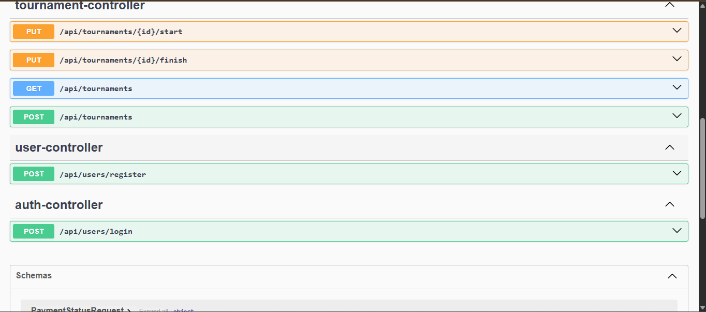
=======
# Sprint 2

## PostMan

### POST /players/filter
* Prueba 8 jugador

Filtro por nombre y posición

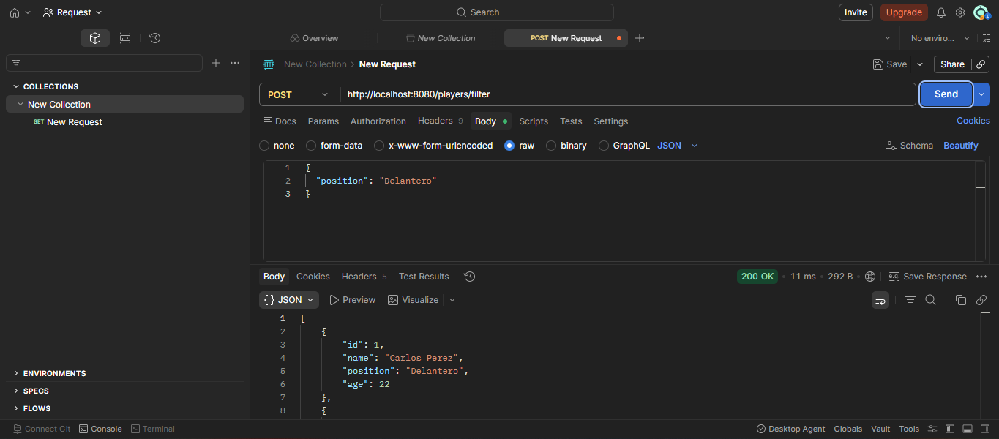

## JaCoCo
* La cobertura total de instrucciones es del 52% y de ramas del 28%. El paquete services lidera con 93% y models.enums
alcanza el 100%. Los paquetes controllers y config tienen la cobertura más baja.

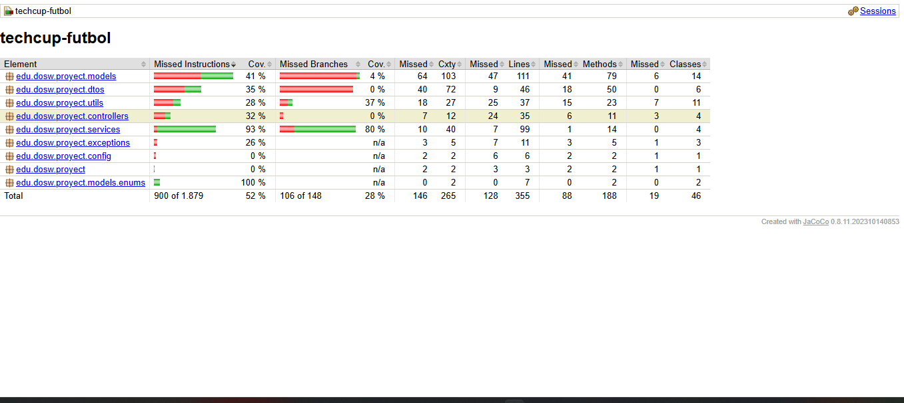

## SonarQube
* El análisis detalla que el proyecto tiene 0 issues de seguridad y 0 de confiabilidad, ambos con rating A. 
La mantenibilidad reporta 16 issues abiertos pero también con rating A. La cobertura alcanza el 49.5% sobre 360 líneas
y no se detectan duplicaciones en las 1.2k líneas analizadas.

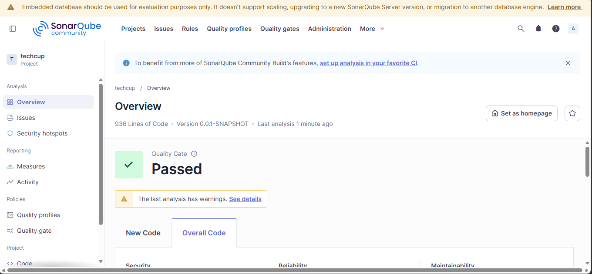
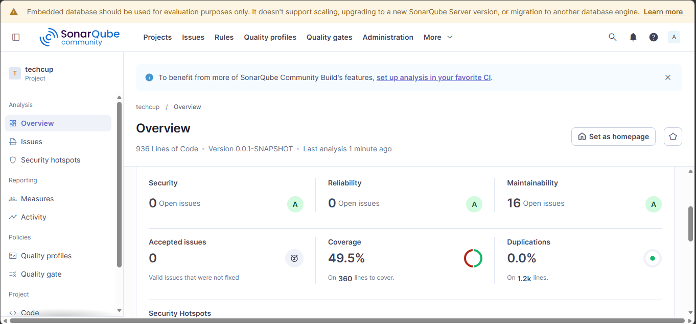

=======
#  Diagramas de Secuencia

## Controlador Equipo
* El actor invoca el servicio a través del EquipoController, que delega en EquipoServiceImpl. Se verifica que el 
usuario capitán exista en UserRepository, se valida que no haya un equipo con el mismo nombre en EquipoRepository,
y se comienza a construir el equipo con el patrón Builder asignando nombre, escudo, colores de uniforme y capitán.
  Se persiste el equipo y la invitación en sus repositorios, luego se mapea la respuesta con EquipoMapper construyendo 
un CrearEquipoResponseDTO con el mensaje de confirmación y la lista de notificaciones enviadas a los jugadores invitados.

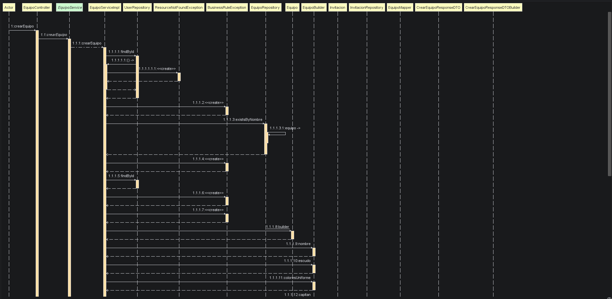
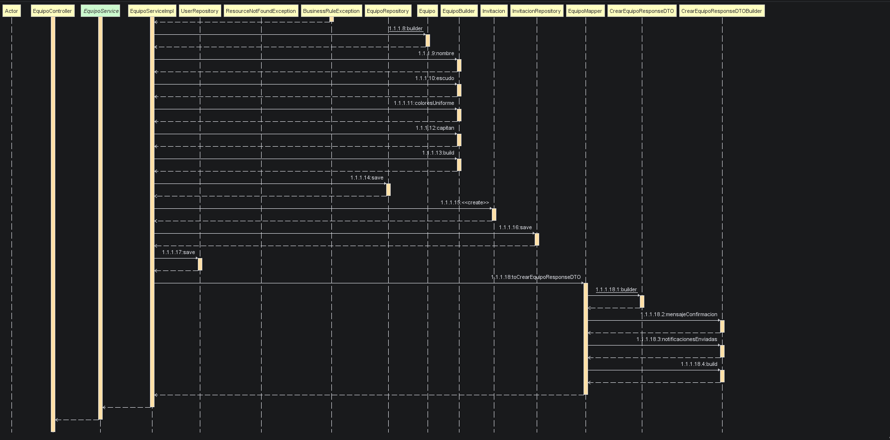

## Controlador Invitacion

* El actor llama a responderInvitacion desde el InvitacionController. El servicio busca al usuario y la invitación por ID
en sus repositorios, crea las entidades necesarias y persiste los cambios. Se inicia la construcción del 
InvitacionResponseDTO. e completa la construcción del DTO con invitacionId, mensajeCapitan y estadoActualizado, 
y se retorna la respuesta al actor.

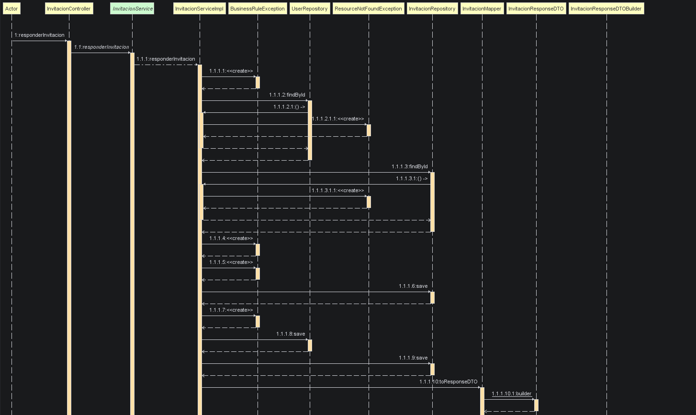
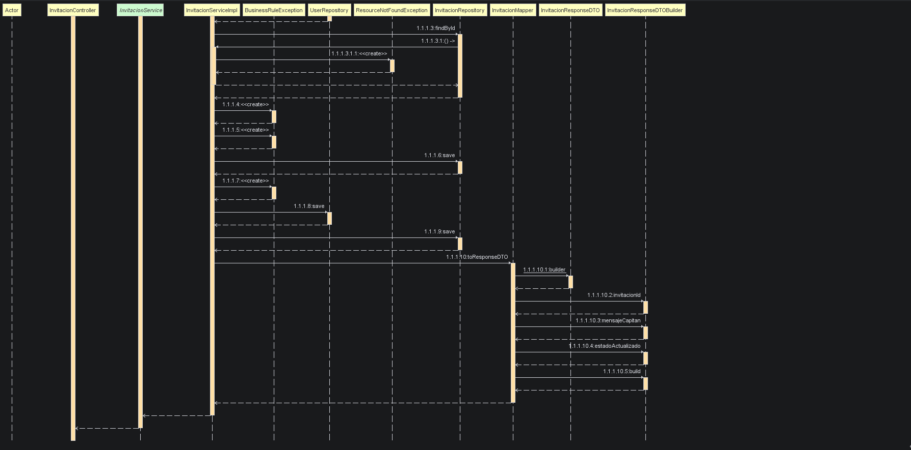

## Controlador Jugador
* El actor llama a actualizarDisponibilidad desde el JugadorController. El servicio busca al jugador por ID, mapea 
el estado con DisponibilidadMapper, persiste el cambio y retorna un DisponibilidadResponseDTO con el mensaje y el estado final.
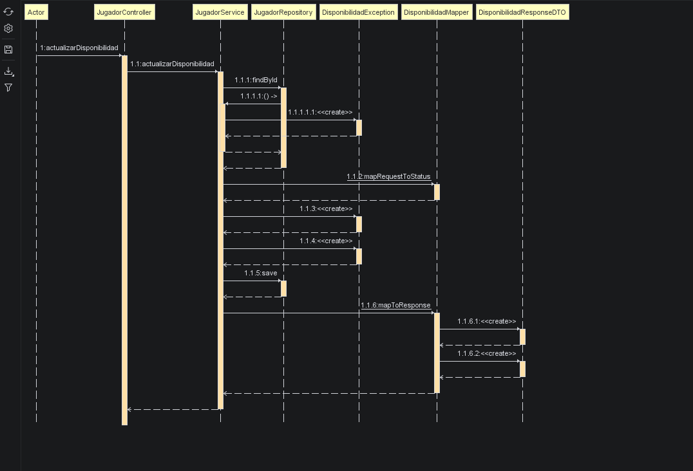