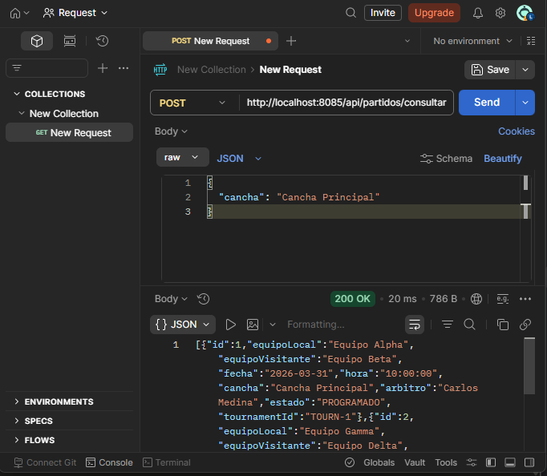
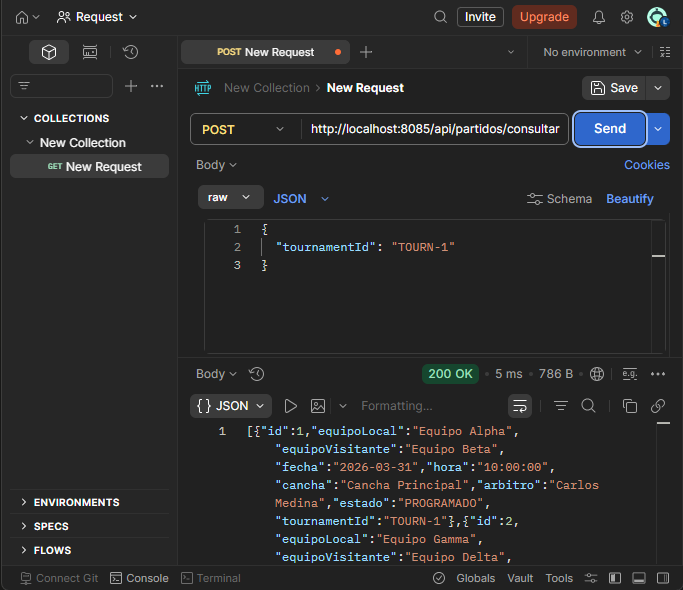
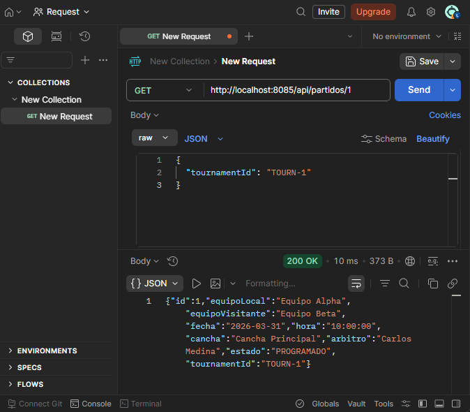
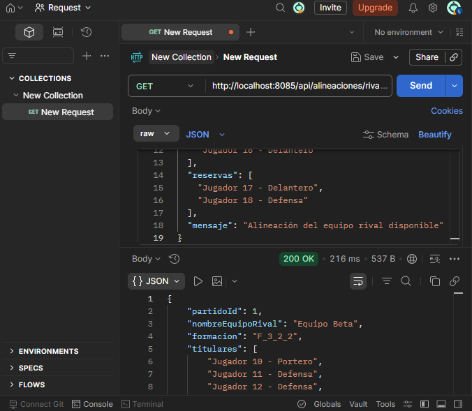
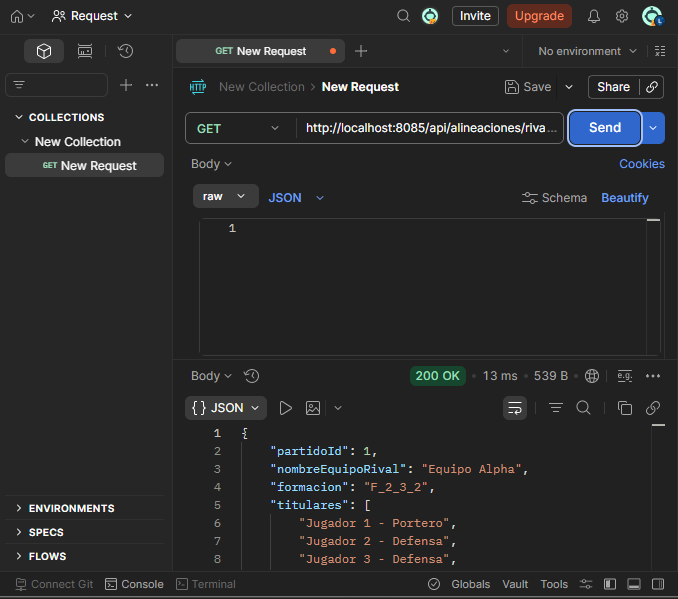
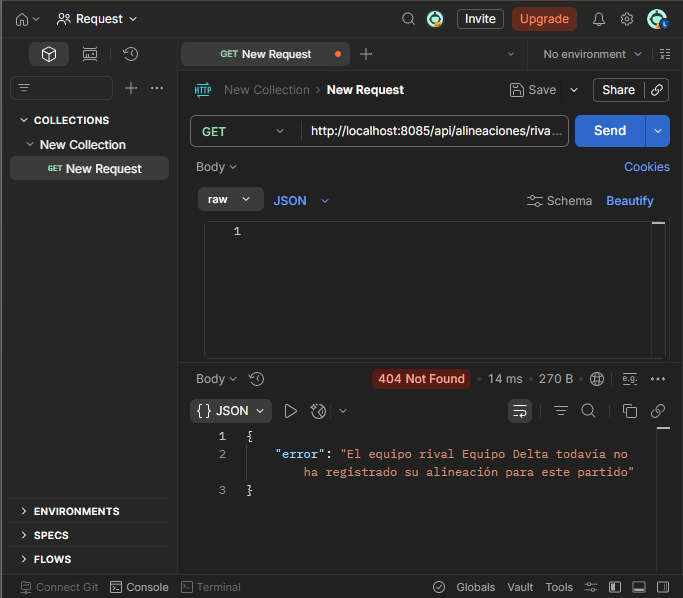
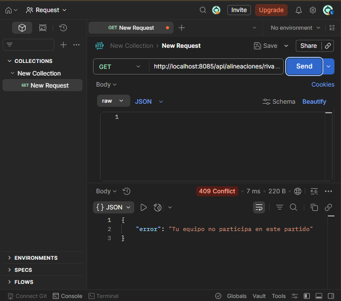
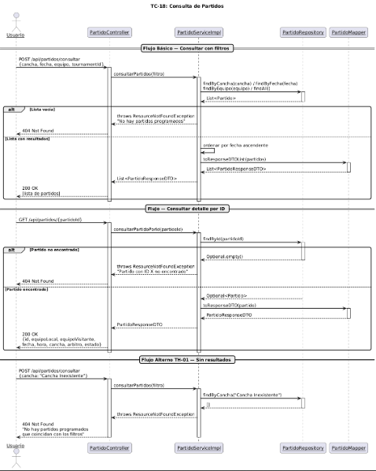
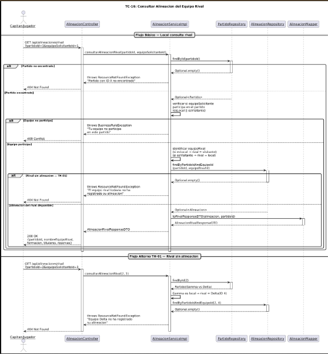

# Sprint 3

##  Integrantes del Equipo

| Nombre | Rol     |
|--------|---------|
| Juan Esteban Sanchez | Backend |
| Zharik Natalia Mahecha | Backend |
| Mariana Parra Urrego | Fronted |
| Isaac David Burgos | Lider   |
| Laura Valentina Santiago | Backend |

### Consultar partido

#### Swagger

En la imagen podemos observar los endpoints que creamos para cada Tag, donde los endpoints son los siguientes

POST      /api/partidos/consultar   Consultar partidos
GET       /api/partidos/{partidoId} Consultar detalle de un partido

#### Postman

- Prueba 1 Cosultar todos los partidos

Se consultan todos los partidos programados sin aplicar ningun tipo de filtro

- Prueba 2 Filtramos por cancha

Se aplica el filtro por cancha para solo observar los partidos de una cancha especifica

- Prueba 3 Filtro por equipos

Se aplica el filtro por equipos para solo obtener lso partidos de un equipo en especifico.

- Prueba 4 Filtro por torneo

Se aplica el filtro por el ID  del torneo, permitiendo ver los partidos de un torneo en especifico.

- Prueba 5 Consultar un partido en especifico

Se consulta el detalle completo de un partido por su ID.

- Prueba 6 Filtro sin resultados

Se aplica un fitro con una cancha que no existe

### Consultar alineacion de equipo rival

#### Postman

- Prueba 1 Equipo local consulta alineacion de visitante

El Equipo Alpha (local, ID 1) consulta la alineacion del Equipo Beta
(visitante, ID 2) para el partido 1. El sistema retorna la formacion tactica,
los 7 titulares y los reservas del rival

- Prueba 2 Equipo visitante consulta alienacion del local

El Equipo Beta (visitante, ID 2) consulta la alineacion del Equipo Alpha
(local, ID 1). El sistema identifica correctamente quien es el rival segun el rol
del solicitante en el partido y retorna su alineacion.

- Prueba 3 Rival no ha registrado su alineacion

El Equipo Gamma (ID 3) consulta
la alineacion del Equipo Delta (ID 4) para el partido 2, pero Delta aún no ha
registrado su alineacion.

- Prueba 4 Equipo no participa en el partido

Un equipo con ID 99 intenta consultar la alineacion del partido 1,
pero no es ni el equipo local ni el visitante de ese partido.

#### Diagrama de secuencia

###### Conultar partidos

###### Conultar alineacion de equipo rival

