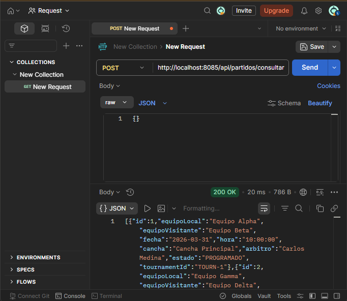

# Sprint 3

##  Integrantes del Equipo

| Nombre | Rol     |
|--------|---------|
| Juan Esteban Sanchez | Backend |
| Zharik Natalia Mahecha | Backend |
| Mariana Parra Urrego | Fronted |
| Isaac David Burgos | Lider   |
| Laura Valentina Santiago | Backend |

### Consultar partido

#### Swagger

En la imagen podemos observar los endpoints que creamos para cada Tag, donde los endpoints son los siguientes

POST      /api/partidos/consultar   Consultar partidos
GET       /api/partidos/{partidoId} Consultar detalle de un partido

#### Postman

- Prueba 1 Cosultar todos los partidos

Se consultan todos los partidos programados sin aplicar ningun tipo de filtro

- Prueba 2 Filtramos por cancha

Se aplica el filtro por cancha para solo observar los partidos de una cancha especifica

- Prueba 3 Filtro por equipos

Se aplica el filtro por equipos para solo obtener lso partidos de un equipo en especifico.

- Prueba 4 Filtro por torneo

Se aplica el filtro por el ID  del torneo, permitiendo ver los partidos de un torneo en especifico.

- Prueba 5 Consultar un partido en especifico

Se consulta el detalle completo de un partido por su ID.

- Prueba 6 Filtro sin resultados

Se aplica un fitro con una cancha que no existe

