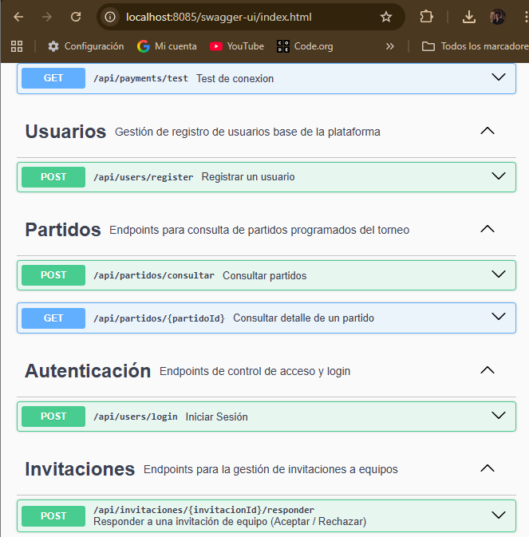
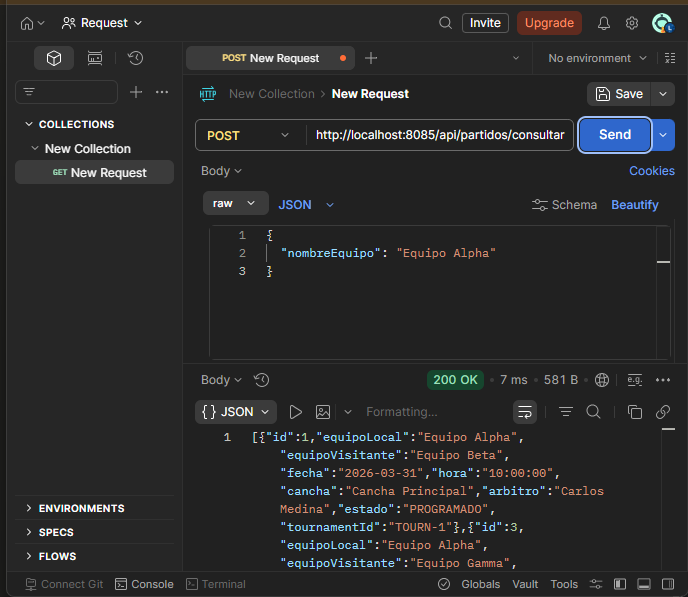
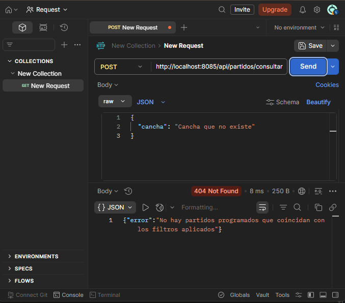
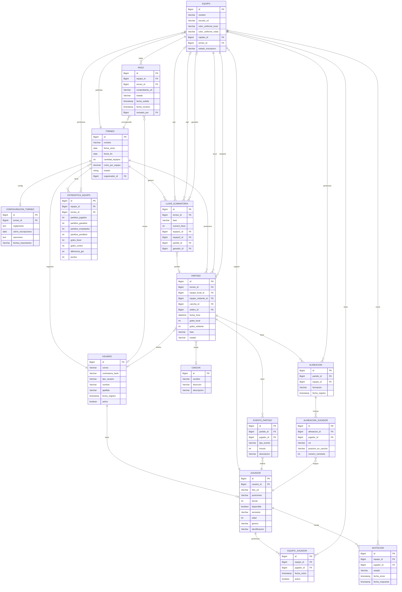

# Sprint 3

##  Integrantes del Equipo

| Nombre                      | Rol      |
|-----------------------------|----------|
| Isaac David Burgos          | Líder    |
| Andrea Mariana Parra Urrego | Frontend |
| Juan Esteban Sanchez        | Backend  |
| Laura Valentina Santiago    | Backend  |
| Zharik Natalia Mahecha      | Backend  |

### Objetivo del Sprint
Elevar el sistema TechCup a un nivel de producción real implementando las funcionalidades core del torneo: configuración de torneos, gestión y consulta de alineaciones, consulta de partidos, tabla de posiciones automática y estadísticas. Adicionalmente, migrar la persistencia de memoria a base de datos relacional, blindar la API con seguridad 
### Historias incluidas

- TC-14 Configurar torneo
- TC-15 Gestión de alineaciones del team
- TC-16 Consultar alineación rival
- TC-18 Consultar partidos
- TC-19 Tabla de posiciones automática
- TC-21 Estadísticas del torneo
- Implementación del Diagrama de Entidad-Relación
-  Persistencia 
- Seguridad 

#### Swagger

En la imagen podemos observar los endpoints que creamos para cada Tag, donde los endpoints son los siguientes

POST      /api/partidos/consultar   Consultar partidos
GET       /api/partidos/{partidoId} Consultar detalle de un partido

#### Postman

- Prueba 1 Cosultar todos los partidos

Se consultan todos los partidos programados sin aplicar ningun tipo de filtro

- Prueba 2 Filtramos por soccerField

Se aplica el filtro por soccerField para solo observar los partidos de una soccerField especifica

- Prueba 3 Filtro por teams

Se aplica el filtro por teams para solo obtener lso partidos de un team en especifico.

- Prueba 4 Filtro por torneo

Se aplica el filtro por el ID  del torneo, permitiendo ver los partidos de un torneo en especifico.

- Prueba 5 Consultar un partido en especifico

Se consulta el detalle completo de un partido por su ID.

- Prueba 6 Filtro sin resultados

Se aplica un fitro con una soccerField que no existe

### Diagrama entidad-relacion

- El diagrama de entidad-relación muestra el modelo de datos del sistema TechCup, es decir, cómo están estructuradas las tablas, qué atributos tiene cada una y cómo se relacionan entre ellas a través de llaves foráneas.
Comenzando por el centro del diagrama, la entidad más importante es PARTIDO, que actúa como el núcleo del sistema porque casi todas las demás entidades se conectan a ella. Un partido tiene su propio id como llave primaria, referencias al torneo al que pertenece (torneo_id), al team local (equipo_local_id), al team visitante (equipo_visitante_id), y también guarda la soccerField, la fecha, el estado y los goles de cada team.
- La entidad EQUIPO está en la parte superior y es también muy central. Guarda el nombre, escudo, colores del uniforme, y tiene referencias al capitán y a los jugadores del team. Un team puede participar en muchos partidos, tanto como local como visitante, por eso tiene dos relaciones distintas hacia PARTIDO.
- La entidad TORNEO se relaciona con PARTIDO con una cardinalidad de uno a muchos, es decir, un torneo puede tener muchos partidos. También se relaciona con CONFIGURACION_TORNEO, que guarda parámetros como el reglamento y fechas límite.
- La entidad JUGADOR está en la parte inferior izquierda y guarda información del jugador como su contraseña hash, tipo de posición, cuota, goles y si está disponible. Se relaciona con RELACION_JUGADOR para gestionar su participación en teams, y con ALINEACION_JUGADOR para registrar en qué alineaciones ha participado.
- La entidad ESTADISTICA_EQUIPO recoge los datos calculados de cada team por torneo, incluyendo partidos jugados, partidos ganados, empates, goles a favor, goles en contra, diferencia de goles y puntos. Esta entidad se actualiza automáticamente cuando se registra el resultado de un partido.
- La entidad TEAM_LINEUP o alineación del team está en el centro superior y guarda el torneo_id, equipo_id, partido_id, capitan_id, la formación táctica seleccionada y el estado de la alineación. Se relaciona con ALINEACION_JUGADOR, que es la tabla intermedia que asocia cada jugador con su posición dentro de esa alineación específica.
- La entidad CANCHA guarda información de cada soccerField donde se juegan los partidos, incluyendo el nombre, la dirección y su disponibilidad.
- La entidad PAGO gestiona los comprobantes de pago de inscripción al torneo, relacionando un jugador con un torneo específico y guardando la fecha, el estado y la descripción del pago.
- La entidad ALINEACION_TITULAR junto con ALINEACION_JUGADOR implementan la lógica de que exactamente 7 jugadores deben ser titulares por partido, con sus posiciones asignadas según la formación táctica elegida.