# Sprint 4

##  Integrantes del Equipo

| Nombre                      | Rol     |
|-----------------------------|---------|
| Isaac David Burgos          | Backend |
| Andrea Mariana Parra Urrego | Backend |
| Juan Esteban Sanchez        | Backend |
| Laura Valentina Santiago    | Fronted |
| Zharik Natalia Mahecha      | Lider   |

### Objetivo del Sprint
Resolver la deuda técnica del Sprint #3, avanzar en la implementación del pipeline CI/CD con GitHub Actions y Azure, e iniciar la implementación de pantallas frontend con conectividad al backend mediante Axios.

### Historias incluidas

- TC - 17: Registro de partidos
- TC - 20: llaves eliminatorias

### Diagrama clases actualizado

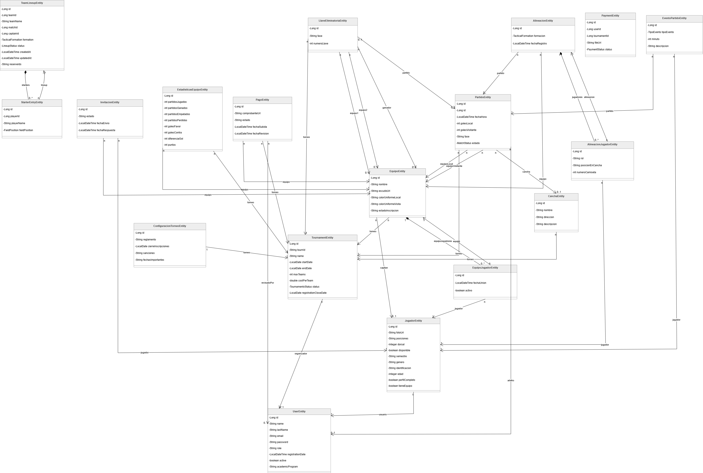

El diagrama representa el modelo de dominio del sistema, donde se definen las entidades principales y sus relaciones para gestionar torneos de fútbol, teams, jugadores y partidos.”

### Diagrama De Despliegue

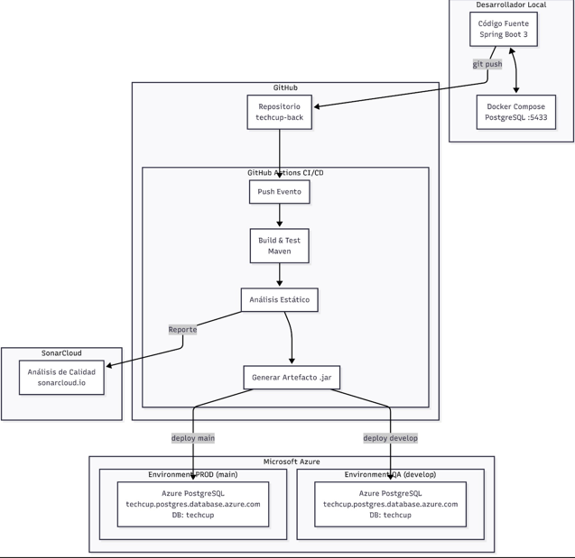

el diagrama muestra el camino que sigue el código desde la PC del programador hasta que llega al usuario final en la nube:
Local: El desarrollador escribe el código en Spring Boot 3 y lo prueba con una base de datos local en Docker.
GitHub (CI/CD): Al subir el código (git push), GitHub Actions toma el relevo. Compila el proyecto con Maven, analiza la calidad con SonarCloud y genera el archivo ejecutable (.jar).
Azure: Si el código es de la rama de desarrollo, se despliega en el entorno de QA; si es la rama principal, se va directo a Producción. Ambos usan bases de datos PostgreSQL hospedadas en Azure.
Es un flujo automatizado para asegurar que nada se rompa antes de publicar.

## Diagramas de Secuencia

### Autentificacion

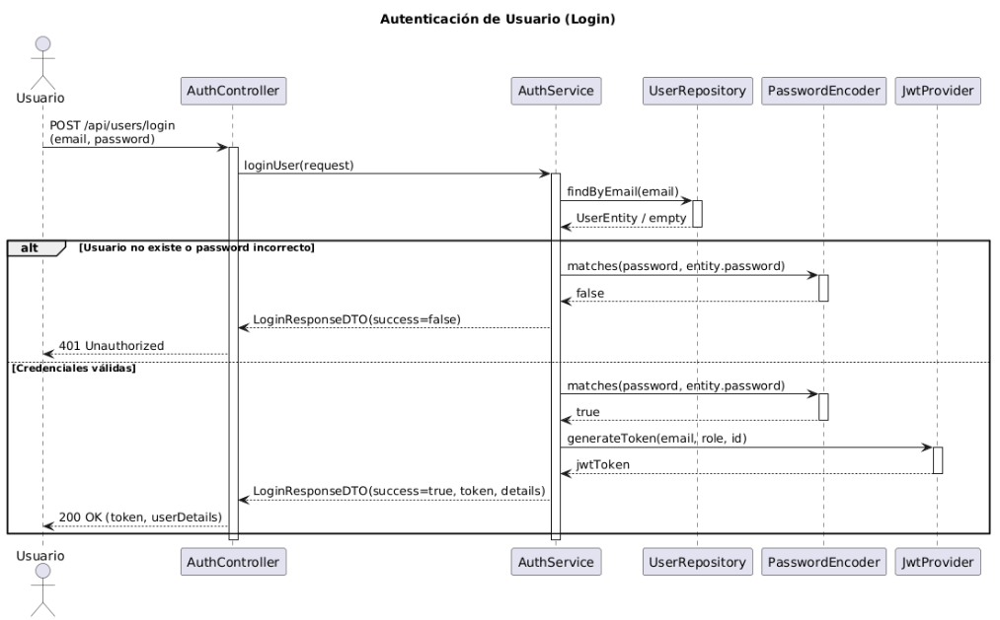
- Este diagrama muestra el proceso de inicio de sesión. El usuario envía su correo y contraseña al AuthController mediante un POST. Este delega al AuthService, que consulta al UserRepository para buscar el usuario por email. Luego se usa PasswordEncoder para comparar la contraseña ingresada con la almacenada. Si las credenciales son incorrectas, se retorna un LoginResponseDTO con success=false y un 401 Unauthorized. Si son válidas, se llama a JwtProvider para generar un token JWT, y se responde con los datos del usuario y el token en un 200 OK.
### Administracion de torneos
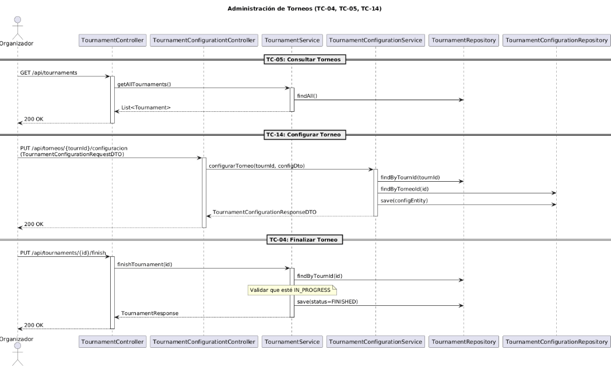
- Este diagrama agrupa tres operaciones. TC-05 permite consultar todos los torneos haciendo un GET que delega al repositorio con findAll(). TC-14 configura un torneo existente mediante PUT: busca el torneo, busca o crea su configuración y la guarda. TC-04 finaliza un torneo: valida que esté en estado IN_PROGRESS antes de cambiar su estado a FINISHED y guardarlo.
### Consulta Tabla de Posiciones
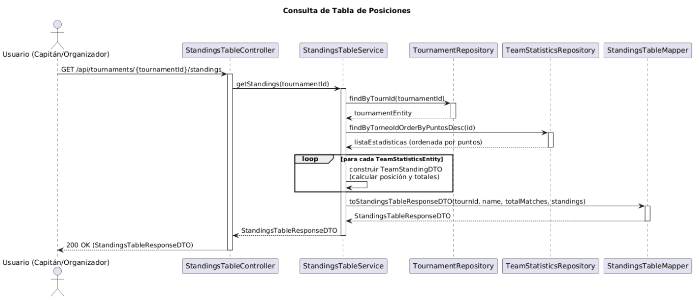
- Cuando un usuario consulta la tabla de posiciones de un torneo, el StandingsTableService primero busca el torneo en TournamentRepository, luego obtiene las estadísticas de los equipos ordenadas por puntos descendente desde TeamStatisticsRepository. Para cada estadística construye un TeamStandingDTO calculando posición y totales. Finalmente usa el StandingsTableMapper para armar el StandingsTableResponseDTO completo y lo retorna con un 200 OK.
### Creacion de equipo
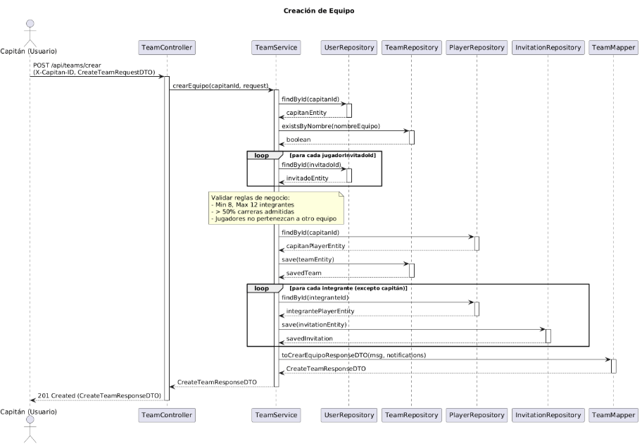
- El capitán envía una solicitud con los jugadores a invitar. El TeamService valida que el nombre del equipo no exista, que haya entre 8 y 12 integrantes, que más del 50% sean de carreras admitidas y que ninguno pertenezca ya a otro equipo. Luego crea la entidad del equipo y, en un ciclo, genera una invitación para cada integrante excepto el capitán. Finalmente retorna un CreateTeamResponseDTO con el resultado y las notificaciones generadas.
### Gestion alineaciones
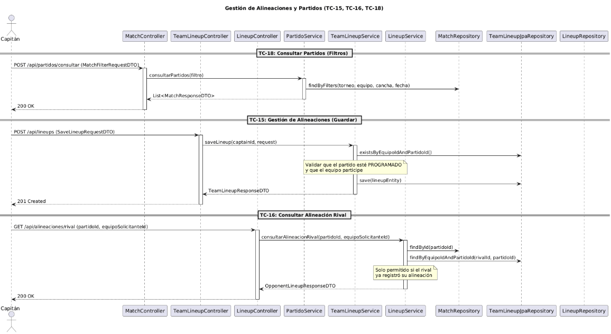
- En TC-18 el capitán puede consultar partidos aplicando filtros como torneo, equipo, cancha o fecha. En TC-15 guarda su alineación: se valida que el partido esté en estado PROGRAMADO y que el equipo participe en él antes de persistir la alineación. En TC-16 un equipo puede consultar la alineación del rival, pero solo si ese rival ya registró la suya previamente, lo cual es un control de negocio importante para evitar ventajas tácticas.
### Gestion de pagos
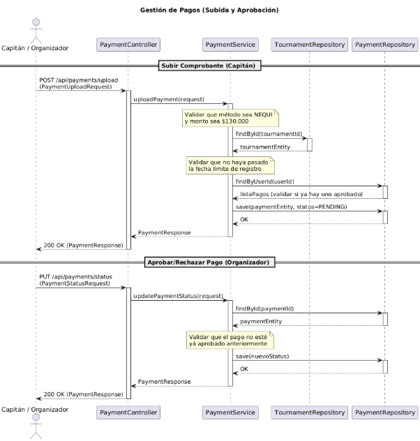
- El capitán sube un comprobante de pago con un POST: el servicio valida que el método sea NEQUI y el monto sea exactamente $130.000, que no haya pasado la fecha límite de registro y que el usuario no tenga ya un pago aprobado. Si todo es válido, guarda el pago en estado PENDING. El organizador luego puede aprobar o rechazar ese pago mediante un PUT: busca el pago y valida que no esté ya aprobado antes de actualizar su estado.
### Gestion de torneos
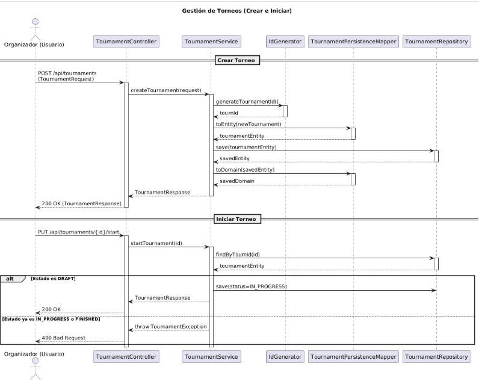
- El organizador puede crear un torneo haciendo un POST: el servicio genera un ID único, convierte la solicitud en entidad, la persiste y retorna el dominio mapeado. Para iniciar el torneo se hace un PUT con el ID; el servicio busca el torneo y valida que esté en estado DRAFT antes de actualizarlo a IN_PROGRESS. Si ya está en IN_PROGRESS o FINISHED, lanza una excepción y retorna un 400 Bad Request.
### Gestion de usuario
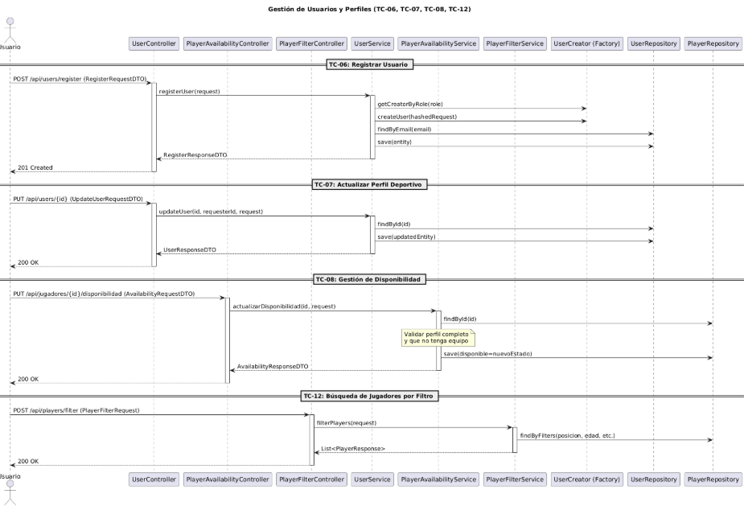
- En TC-18 el capitán puede consultar partidos aplicando filtros como torneo, equipo, cancha o fecha. En TC-15 guarda su alineación: se valida que el partido esté en estado PROGRAMADO y que el equipo participe en él antes de persistir la alineación. En TC-16 un equipo puede consultar la alineación del rival, pero solo si ese rival ya registró la suya previamente, lo cual es un control de negocio importante para evitar ventajas tácticas.
### Registro resultado partido
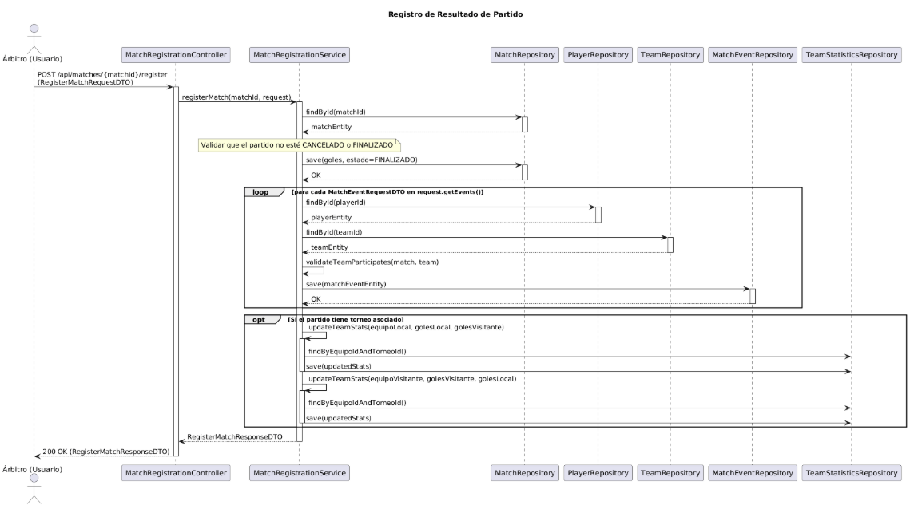
- El árbitro registra el resultado de un partido haciendo un POST. El servicio valida que el partido no esté CANCELADO ni ya FINALIZADO, luego guarda los goles y cambia el estado a FINALIZADO. En un ciclo, procesa cada evento del partido: busca el jugador y el equipo, valida que ese equipo participe en el partido y guarda el evento. Si el partido tiene torneo asociado, actualiza las estadísticas de ambos equipos en el TeamStatisticsRepository, incluyendo goles a favor, en contra y puntos.
### Respuesta a invitacion de equipo
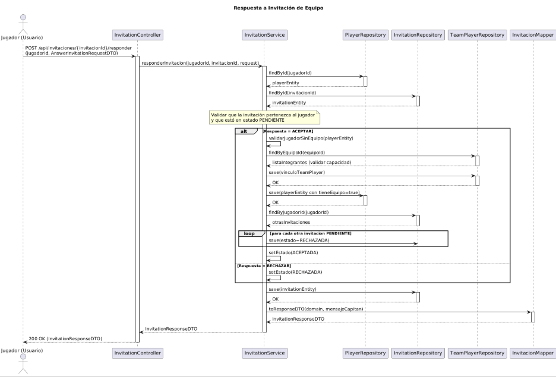

- El jugador responde una invitación mediante un POST. El InvitationService valida que la invitación le pertenezca y esté en estado PENDIENTE. Si acepta, se verifica que no tenga equipo, se valida la capacidad del equipo, se crea el vínculo TeamPlayer, se marca al jugador como con equipo y se rechazan automáticamente sus otras invitaciones pendientes. Si rechaza, simplemente se marca como RECHAZADA. Al final se retorna un InvitationResponseDTO con el mensaje para el capitán.